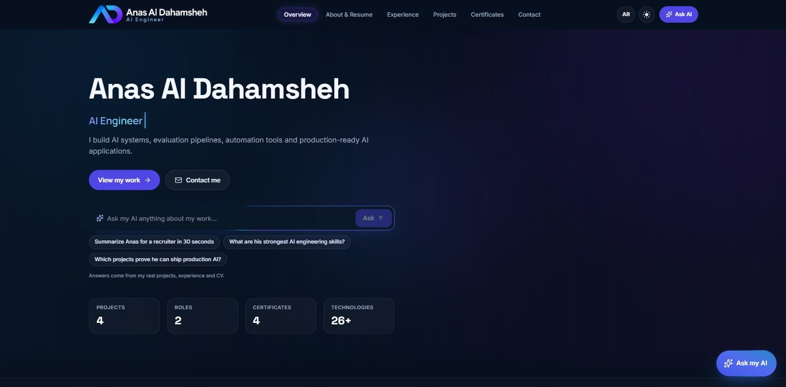
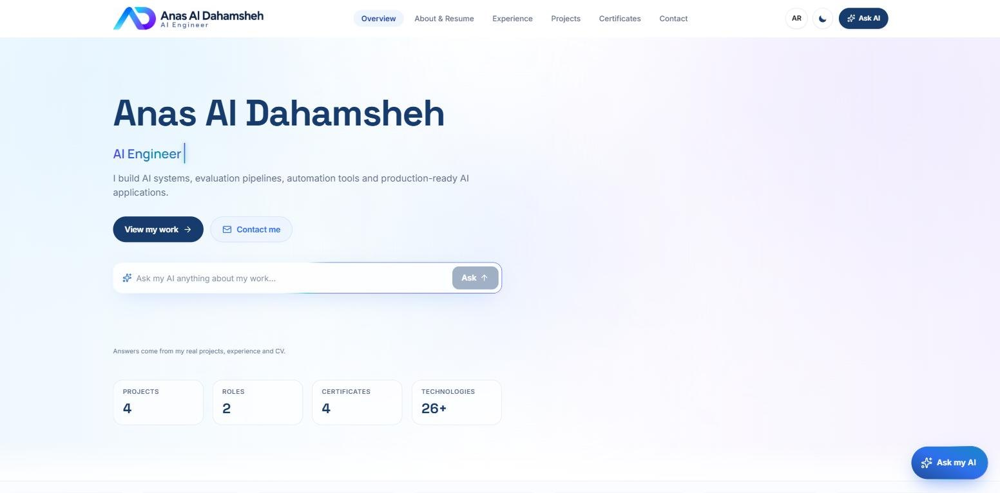
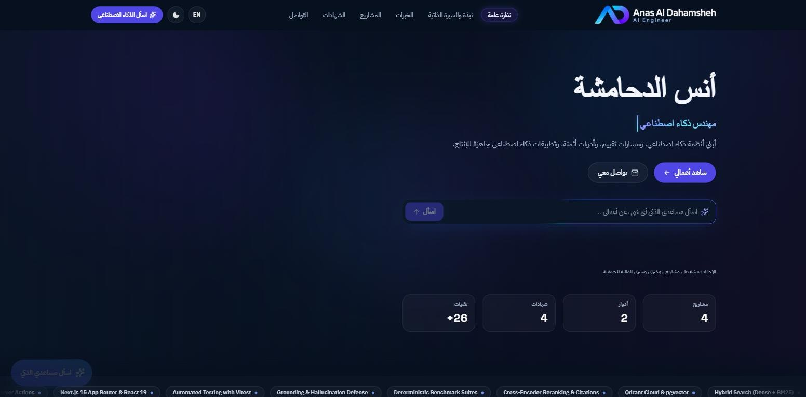
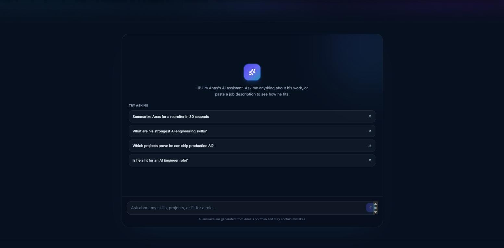

<div align="center">

<picture>
  <source media="(prefers-color-scheme: dark)" srcset="public/images/logo-dark.png" />
  
</picture>

### AI Engineer Portfolio with a Grounded AI Assistant — English / العربية

A bilingual portfolio whose **AI assistant knows everything the owner publishes or uploads** — projects, experience, CV, certificates and knowledge files — and answers with **citations**. The owner edits any text or item **in place**, and every change is re-indexed for the assistant instantly.

[](LICENSE)


**Engineered by Anas Aldahamsheh — تطوير: أنس الدحامشة**



</div>

---

## 📖 Overview

The site is a **Next.js 16** app backed by **PostgreSQL (Neon) + pgvector**:

- **Public pages** are prerendered and cached; an admin edit expires only the pages it affects.
- **Every piece of content** (profile, projects, experience, education, certificates, skills, knowledge files, private notes) is one validated, versioned entry, written per language with field-by-field fallback.
- **The AI assistant** is a Gemini tool-calling agent: it looks facts up through tools and a **hybrid RAG** index instead of receiving the whole portfolio in its prompt, so answers stay grounded and cite their sources.

---

## ✨ Features

### 🌐 Public Site

- Overview, About & Resume, Experience, Projects (with case-study pages), Certificates, Contact
- **CV viewer and download**, plus a **Job Fit** page: paste a job description and see the evidence for each requirement
- Scroll reveals, split-text heroes, tilt cards, animated navigation and view transitions — while pages stay server-rendered and crawlable
- SEO: per-language metadata, canonical / alternate links, Open Graph image, `sitemap.xml` and `robots.txt`

### 🤖 AI Assistant

- Floating chat panel on every page and a full chat page (`/chat`)
- Tools: `get_profile`, `list_projects`, `get_project`, `list_experience`, `list_education_and_certificates`, `get_skills` (skills mapped to the projects and roles that prove them), `match_job_requirements` and `search_knowledge`
- Answers stream over **SSE** with **citations** to the pages they came from; links that did not come from a tool are removed
- Follow-up suggestions, model fallback, retries and **database-backed rate limits**
- Replies in the visitor's language (Arabic or English)

### 🔎 Hybrid Retrieval (RAG)

- Bilingual normalisation and light stemming
- **Gemini embeddings in pgvector (HNSW)** + Postgres **full-text** search + **trigram** title matching
- Weighted **Reciprocal Rank Fusion**, cross-language de-duplication and **LLM reranking**
- **Always in sync:** saving, hiding or deleting anything re-indexes (or forgets) it immediately, and only chunks whose text changed are re-embedded
- Uploaded PDFs and images are read by Gemini and indexed as knowledge

### 🛠️ Admin

- Public sign-up is disabled; the owner account is created from the command line
- **Edit mode:** click any text or item on the site to change it in place
- Dashboard (`/en/admin`): content, **CV and knowledge files**, assistant settings and the **questions visitors asked**
- Uploads (CV, images, documents) are stored in Postgres and served from `/media/[id]`

### 🌍 Experience & Security

- Full **Arabic / English** interface with automatic **RTL / LTR** and language detection
- **Light / dark** themes and responsive layouts
- Security headers (HSTS, `X-Frame-Options`, `nosniff`, `Referrer-Policy`, `Permissions-Policy`) and a health endpoint (`/api/health`)

---

## 📸 Screenshots

|                                    Light theme                                     |                           Arabic interface (RTL)                            |
| :--------------------------------------------------------------------------------: | :-------------------------------------------------------------------------: |
|  |    |
|                                  **AI assistant**                                  |                               **Dark theme**                                |
|         |  |

---

## 🧰 Tech Stack

| Layer          | Technology                                                                                                            |
| -------------- | --------------------------------------------------------------------------------------------------------------------- |
| Framework      | [Next.js 16](https://nextjs.org/) (App Router, Cache Components, Server Actions)                                      |
| UI             | [React 19](https://react.dev/), TypeScript, [Tailwind CSS 4](https://tailwindcss.com/), [Motion](https://motion.dev/) |
| Database       | PostgreSQL ([Neon](https://neon.tech/)) + [pgvector](https://github.com/pgvector/pgvector) + `pg_trgm`                |
| ORM            | [Drizzle ORM](https://orm.drizzle.team/) + Drizzle Kit                                                                |
| Authentication | [Better Auth](https://www.better-auth.com/)                                                                           |
| AI             | [Google Gemini](https://ai.google.dev/) (chat, tool calling, embeddings, reranking, document reading)                 |
| Validation     | [Zod](https://zod.dev/)                                                                                               |
| Quality        | ESLint, Prettier, [Vitest](https://vitest.dev/), GitHub Actions                                                       |

---

## 🚀 Getting Started

### Prerequisites

- **Node.js 22.9+** (see [`.nvmrc`](.nvmrc)) and **pnpm 10+** — `corepack enable` or `npm install -g pnpm`
- **PostgreSQL** with the `vector` and `pg_trgm` extensions — a free [Neon](https://neon.tech/) database works out of the box, or run one locally:
  ```bash
  docker run -d --name portfolio-db -p 5439:5432 \
    -e POSTGRES_PASSWORD=postgres -e POSTGRES_DB=portfolio_dev pgvector/pgvector:pg17
  ```
- A **Google Gemini API key** — get one at [Google AI Studio](https://aistudio.google.com/apikey)

### Installation

```bash
# 1. Clone the repository
git clone https://github.com/anas-aldahamsheh/Anas-AI-Portfolio.git
cd Anas-AI-Portfolio

# 2. Install dependencies
pnpm install

# 3. Create your environment file and fill in DATABASE_URL, BETTER_AUTH_SECRET and GEMINI_API_KEY
cp .env.example .env.local          # on Windows (PowerShell): copy .env.example .env.local

# 4. Create the tables (additive and idempotent — safe to re-run)
pnpm db:migrate

# 5. Add the starter content and build the AI index (only fills what is missing)
pnpm db:seed

# 6. Create the owner (admin) account
pnpm admin -- --email you@example.com --password "a long password" --name "Your Name"

# 7. Start the development server
pnpm dev
```

Open **[http://localhost:3000](http://localhost:3000)** — you are redirected to `/en` or `/ar` based on your browser language. Sign in at `/en/sign-in` to edit the site.

### Environment Variables

All variables are documented in [`.env.example`](.env.example).

| Variable                                  | Required | Description                                                                     |
| ----------------------------------------- | -------- | ------------------------------------------------------------------------------- |
| `DATABASE_URL`                            | Yes      | PostgreSQL connection string (use Neon's pooled `-pooler` URL in production)    |
| `BETTER_AUTH_SECRET`                      | Yes      | 32+ random characters — `openssl rand -base64 32`                               |
| `BETTER_AUTH_URL` / `NEXT_PUBLIC_APP_URL` | Yes      | Public URL of the site (auth callbacks, metadata and sitemap)                   |
| `GEMINI_API_KEY`                          | Yes      | Google Gemini key for the assistant, embeddings, reranking and file reading     |
| `GEMINI_EMBEDDING_MODEL`                  | No       | Embedding model (default `gemini-embedding-2`; changing it requires a re-index) |
| `NEXT_PUBLIC_SITE_URL`                    | No       | Canonical URL when it differs from `BETTER_AUTH_URL`                            |

> ⚠️ Never commit your real `.env.local` file. It is already excluded by `.gitignore`.

---

## 📜 Available Scripts

| Command            | Description                                                                 |
| ------------------ | --------------------------------------------------------------------------- |
| `pnpm dev`         | Start the development server                                                |
| `pnpm build`       | Create a production build                                                   |
| `pnpm start`       | Run the production build                                                    |
| `pnpm lint`        | Lint with ESLint                                                            |
| `pnpm typecheck`   | Generate route types and type-check with TypeScript                         |
| `pnpm format`      | Format with Prettier (`pnpm format:check` to only check)                    |
| `pnpm db:migrate`  | Apply database migrations                                                   |
| `pnpm db:seed`     | Add starter content and build the AI index (`--no-index` to skip the index) |
| `pnpm db:generate` | Generate a new migration from the Drizzle schema                            |
| `pnpm db:studio`   | Open Drizzle Studio                                                         |
| `pnpm admin`       | Create the owner account or reset its password                              |

---

## 🏗️ Project Structure

```txt
app/
├── [locale]/
│   ├── (site)/              # Public pages: overview, cv, experience, projects, certificates, contact, chat, job-fit
│   ├── (auth)/sign-in/      # Owner sign-in (sign-up is disabled)
│   └── admin/               # Admin dashboard
├── api/                     # assistant (SSE), auth, cv, health, admin session
├── media/[id]/              # Uploaded files served from Postgres
├── robots.ts · sitemap.ts
src/
├── ai/
│   ├── assistant/           # Agent loop, tools, prompt, citations, follow-up suggestions
│   ├── gemini/              # Gemini API client and types
│   └── knowledge/           # Chunking, normalisation, indexing, hybrid retrieval, reranking
├── features/                # UI: site shell, home, projects, cv, assistant, admin dashboard & inline editor
├── server/                  # Content repository & mutations, knowledge sync, media, auth, security
├── lib/                     # Database client & schema (Drizzle), auth, utilities
├── i18n/                    # English / Arabic messages and locale helpers
└── ui/                      # Shared UI primitives and motion components
drizzle/                     # SQL migrations
scripts/                     # seed and admin CLI
proxy.ts                     # Locale detection and redirects
```

---

## ☁️ Deployment

The project is ready for **Vercel + Neon**:

1. Create a Neon database and import the repository in Vercel.
2. Add the environment variables above (use the pooled `-pooler` connection string for `DATABASE_URL`).
3. Run `pnpm db:migrate`, `pnpm db:seed` and `pnpm admin -- ...` once against the production database.
4. Deploy — the public URL is detected automatically for metadata, sitemap and auth callbacks.

---

## 📄 License

This project is licensed under the [MIT License](LICENSE).

---

## 👨‍💻 Author

**Anas Aldahamsheh — أنس الدحامشة**

- 📞 Phone: `+962 789 495 167`
- 💼 LinkedIn: [linkedin.com/in/anas-aldahamsheh](https://www.linkedin.com/in/anas-aldahamsheh)
- 🐙 GitHub: [github.com/anas-aldahamsheh](https://github.com/anas-aldahamsheh)

---

<div align="center">

⭐ If you find this project useful, consider giving it a star!

</div>
